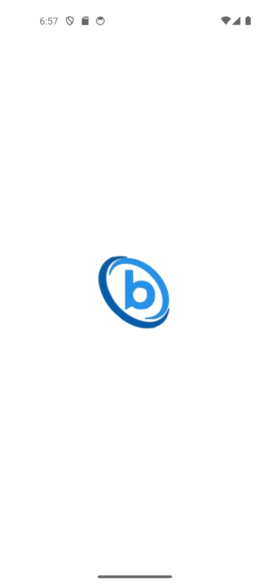
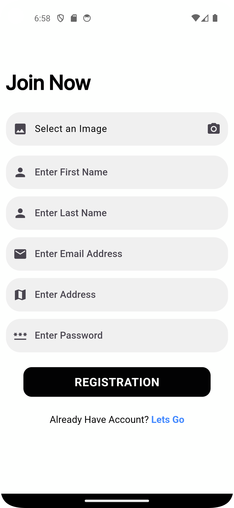
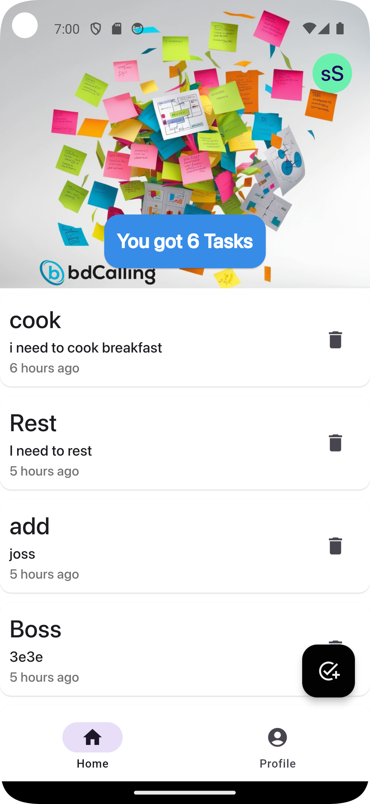
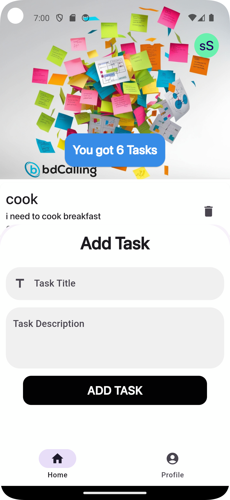
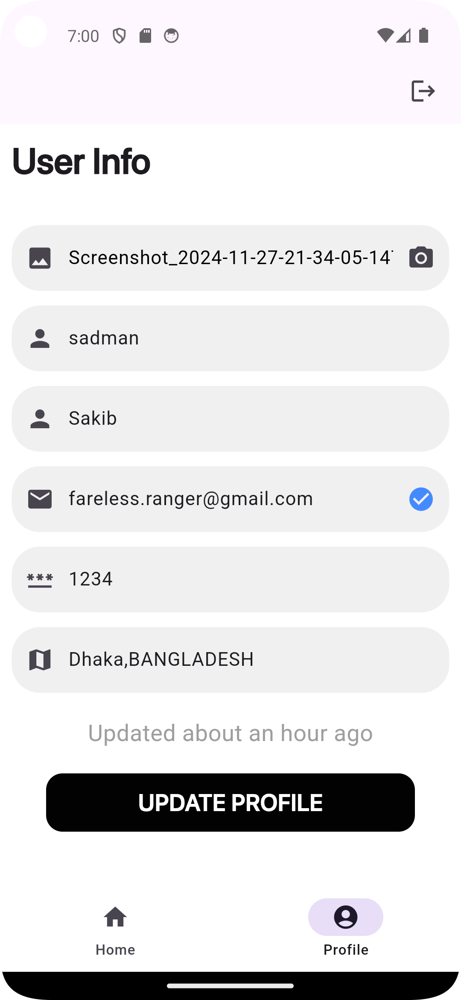

# Task Manager App

A **Task Manager App** built for the hiring assessment of **BdCalling IT Ltd**. This app uses their API to manage tasks efficiently, ensuring a smooth and responsive user experience. It is built using **Flutter**, with **GetX** for state management, **http** for API integration, and **SharedPreferences** for local storage. The app is optimized for different screen sizes using **MediaQuery**.

## Features
- **Splash Screen**: Welcome screen for app branding.
- **Login & Registration**: Secure user authentication and account creation.
- **Account Activation**: OTP-based user activation.
- **Task Management**: Add, view, and manage tasks effortlessly.
- **User Info**: View and update user profile.

## Screenshots
| Splash Screen | Login Screen | Registration Screen |
|---------------|--------------|---------------------|
|  |  |  |

| Account Activation | Home Screen | Add Task | User Info |
|---------------------|-------------|----------|-----------|
|  |  |  |  |

## Technologies Used
- **Flutter**: For building a cross-platform application.
- **GetX**: Simplified state management.
- **http**: To interact with APIs.
- **SharedPreferences**: For local data storage.

## How to Run
1. Clone the repository:
   ```bash
   git clone <repository-url>
   ```
2. Navigate to the project directory:
   ```bash
   cd task_manager_app
   ```
3. Get the Flutter dependencies:
   ```bash
   flutter pub get
   ```
4. Run the app:
   ```bash
   flutter run
   ```

## API Integration
This app is integrated with the BdCalling IT Ltd API to provide task management features. Ensure the API server is running before using the app.

## Directory Structure
```
- lib/
  - controllers/
  - models/
  - views/
  - utils/
- assets/
  - images/
- SS/
  - s1.png
  - s2.png
  - s3.png
  - s4.png
  - s5.png
  - s6.png
  - s7.png
```

## License
This project is built as an assessment for BdCalling IT Ltd. Usage beyond the hiring process requires permission.

---

> **Developed by [Sadman](https://github.com/Sadman)** with ❤️
