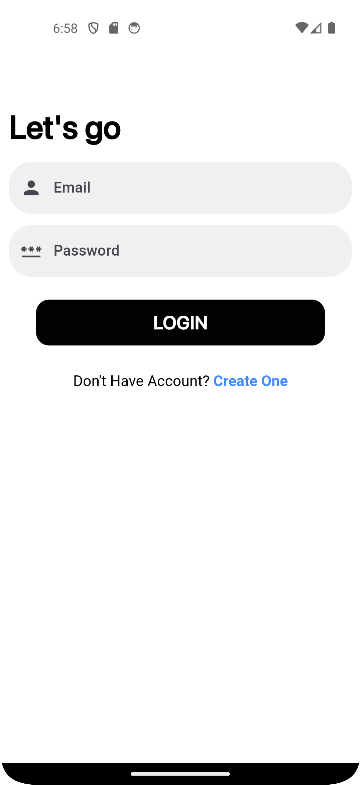

# Task Manager App

A **Task Manager App** built for the hiring assessment of **BdCalling IT Ltd**. This app uses their API to manage tasks efficiently, ensuring a smooth and responsive user experience. It is built using **Flutter**, with **GetX** for state management, **http** for API integration, and **SharedPreferences** for local storage. The app is optimized for different screen sizes using **MediaQuery**.

## Features
- **Splash Screen**: Welcome screen for app branding.
- **Login & Registration**: Secure user authentication and account creation.
- **Account Activation**: OTP-based user activation.
- **Task Management**: Add, view, and manage tasks effortlessly.
- **User Info**: View and update user profile.

## Screenshots
| Splash Screen | Login Screen | Registration Screen |
|---------------|--------------|---------------------|
|  |  |  |

| Account Activation | Home Screen | Add Task | User Info |
|---------------------|-------------|----------|-----------|
|  |  |  |  |

## Technologies Used
- **Flutter**: For building a cross-platform application.
- **GetX**: Simplified state management.
- **http**: To interact with APIs.
- **SharedPreferences**: For local data storage.
